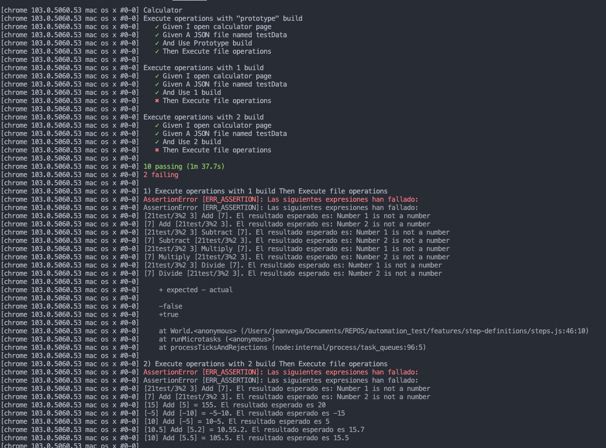

# Prueba de automatización

En este repositorio se encuentra una prueba corta sobre automatización, en la cual se ponen a prueba conocimientos básicos sobre automatización.

## Tecnologías utilizadas

- WebDriverIO
- Selenium
- Cucumber


## Escenarios de prueba 

Al no tener definidos los test cases necesarios para ejecutar la automatización, se definieron unos escenarios básicos para poner en práctica la automatización los cuales se detallan a continuación.

- Validar uso de números únicamente (suma)(numero1).
- Validar uso de números únicamente (suma)(numero2).
- Validar uso de números únicamente (resta) (numero1).
- Validar uso de números únicamente (resta) (numero2).
- Validar uso de números únicamente (multiplicación) (numero1).
- Validar uso de números únicamente (multiplicación) (numero2).
- Validar uso de números únicamente (división) (numero1).
- Validar uso de números únicamente (división) (numero2).

- Verificar suma con dos números enteros positivos.
- Verificar suma con dos números enteros negativos.
- Verificar suma con un entero positivo y con un entero negativo.
- Verificar suma con dos números decimales.
- Verificar suma con un entero y un decimal.

- Verificar resta con dos números enteros positivos.
- Verificar resta con dos números enteros negativos.
- Verificar resta con un entero positivo y con un entero negativo.
- Verificar resta con dos números decimales.
- Verificar resta con un entero y un decimal.

- Verificar multiplicación con dos números enteros positivos.
- Verificar multiplicación con dos números enteros negativos.
- Verificar multiplicación con un entero positivo y con un entero negativo.
- Verificar multiplicación con dos números decimales.
- Verificar multiplicación con un entero y un decimal.

- Verificar división con dos números enteros positivos.
- Verificar división con dos números enteros negativos.
- Verificar división con un entero positivo y con un entero negativo.
- Verificar división con dos números decimales.
- Verificar división con un entero y un decimal.
- Verificar la división de 0 por un numero.
- Verificar la división por 0.

- Verificar concatenación con dos números enteros positivos.
- Verificar concatenación con dos números enteros negativos.
- Verificar concatenación con un entero positivo y con un entero negativo.
- Verificar concatenación con dos números decimales.
- Verificar concatenación de strings.
- Verificar de un numero con un string.

## Elementos a considerar

### Agregar o modificar elementos a la prueba

La aplicación dispone de varias `builds` para probar diferentes escenarios. En esta definición de las pruebas automatizados, se prueba únicamente con 3 barajas, esto para que la prueba no consuma mucho tiempo de ejecución.

Si se desea probar alguna otra o incluir más pruebas se dejan los pasos a continuación:

1. Localizar el archivo `calculator.feature`.
2.	Crear o modificar un nuevo escenario de prueba.
```Gherkin
  Scenario: Execute operations with 1 build
    Given A JSON file named testData
    And Use 1 build
    Then Execute file operations
```

### Archivo de pruebas

Dentro del proyecto, existe un archivo denomindado `testData.json` en el se encuentra los escenarios descritos previamente. Si desea agregar o eliminar escenario se debe seguir la siguiente estructura.

```JSON
[
  { "number1":"21test/3%2 3" , "number2":7, "operator": "Add", "result":0, "errorMsg": "Number 1 is not a number" },
]  
```

## Pasos para ejecutar la prueba

1. Clonar el proyecto
2. Instalar las dependencias
3. Ejecutar el comando de prueba npm run test

### Resultados

Los resultados de las pruebas se muestran en la consola.

Se deja a continuación una serie de resultados posterior a haber ejecutado las pruebas

